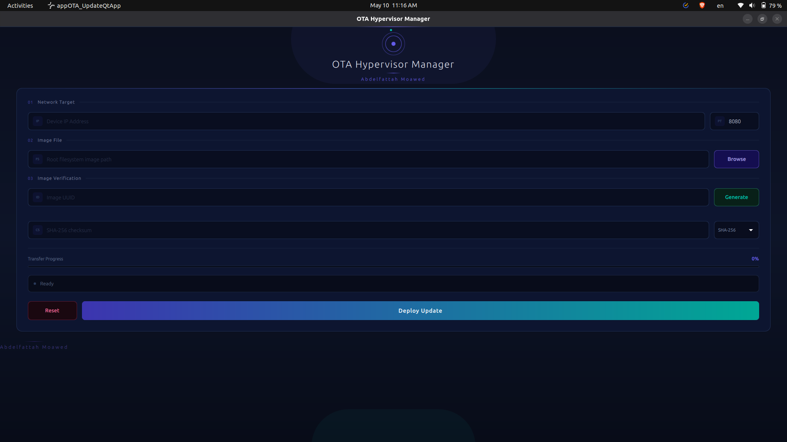

# OTA Hypervisor Manager (PC Client)

A modern desktop GUI application built with Qt 6 (C++ & QML) to deploy Over-The-Air (OTA) `rootfs` updates to a QNX hypervisor target. 

## Features
* **Modern UI:** Built with Qt Quick Controls (Material Dark Theme).
* **Asynchronous Transfer:** Streams large files (e.g., 800MB+ `.ext4` images) over TCP sockets without freezing the UI.
* **Header Generation:** Automatically formats and sends the `UUID|FILESIZE|CHECKSUM\n` header.
* **Live Progress:** Tracks bytes written and updates a live progress bar.
* **Safe Cancellation:** Safely aborts active network transfers.

## Prerequisites
* Ubuntu Linux (or any OS supporting Qt)
* **Qt 6.x** and Qt Creator
* C++17 compatible compiler

## Build and Run

### Using Qt Creator (Recommended)
1. Open the `CMakeLists.txt` (or `.pro` file) in Qt Creator.
2. Select your Qt 6 Desktop Kit.
3. Build and Run.

### Using Command Line (CMake)
```bash
mkdir build && cd build
cmake ..
make
./appOTA_UpdateQtApp
```

### APP

