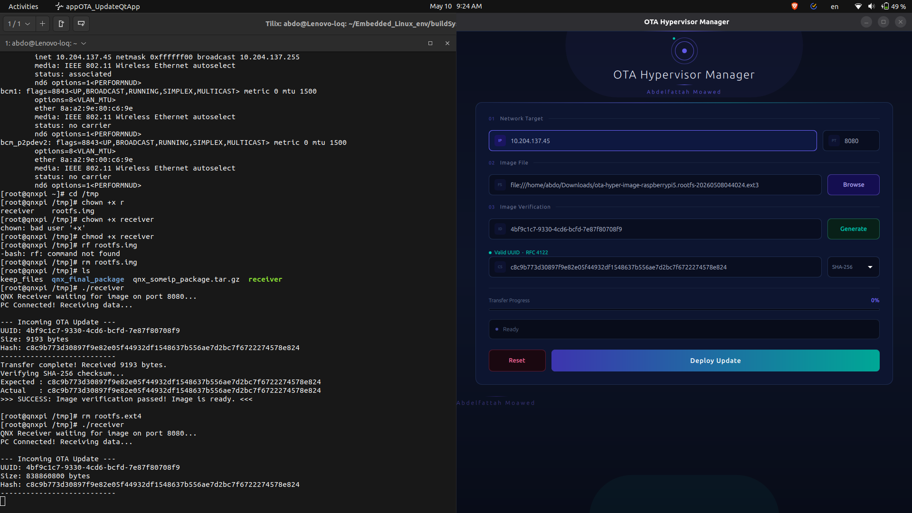

# QNX OTA Receiver Daemon

A lightweight, persistent C++ daemon running on QNX. It listens for incoming TCP connections from the PC, downloads the OTA `rootfs` image, and verifies its integrity before making it available for the Linux guest.

## Features
* **POSIX TCP Sockets:** Efficiently receives streaming binary data in 64KB chunks.
* **Header Parsing:** Extracts UUID, File Size, and SHA-256 hash from the incoming stream.
* **Automatic Verification:** Uses QNX's built-in `sha256sum` tool to verify image integrity after download.
* **File Management:** Automatically moves successfully verified images to `/tmp/rootfs/` and deletes corrupted downloads to save SD card space.
* **Persistent Daemon:** Runs continuously in a `while(true)` loop to accept multiple deployment attempts.

## Prerequisites
* **QNX SDP** (Software Development Platform 7.1 or 8.0) installed on the host PC.
* Target hardware running QNX (e.g., Raspberry Pi 5).

## Cross-Compiling for QNX (ARM64)
Because the target is an ARM-based embedded system, you must cross-compile this code on your Ubuntu PC using the QNX compiler.

1. Source your QNX environment on your PC:
   ```bash
   source ~/qnx800/qnxsdp-env.sh
   q++ -Vgcc_ntoaarch64le receiver.cpp -o receiver -lsocket
   ```
2. Deployment and Execution
- Transfer the compiled binary to the QNX board:
   ```bash
   scp receiver qnxuser@<QNX_IP_ADDRESS>:/tmp/
   ```
3. SSH into the QNX board, make it executable, and run it:
   ```bash
   chmod +x /tmp/receiver
   ./receiver
   ```
- The daemon will print QNX Receiver waiting for image on port 8080... and wait for the Qt app to connect. 

## App

